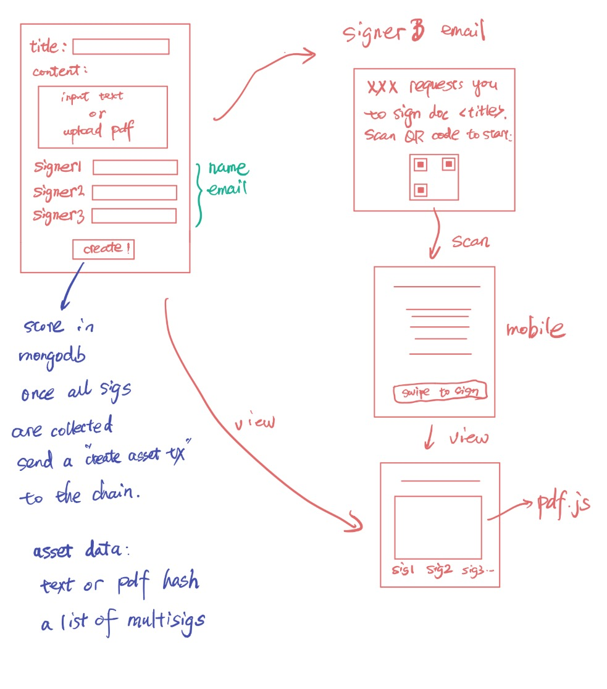
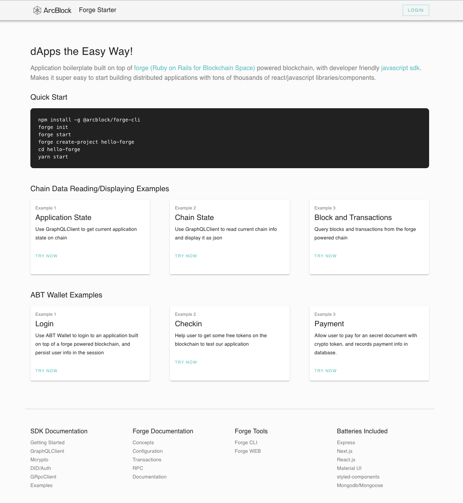

# Block Contract

This is a hackathon project for "The Building Blocks Hackathon at Consensus 2019" (https://consensus2019-blockchain.devpost.com).

Block contract is to build decentralized contract that people can sign, view and trust. To protect the privacy, the content of the contract will *NOT* be hosted in the blockchain, *only the hash* of the content is store in the chain.

We use [ArcBlock's Forge React Stater](#about-forge-react-starter) to build this application and let it handle the basic logic like DID login, so that we can focus on building the core logic.

## High level design

The prototype of the flow of the app looks like this:



## Contract Templates

 is a great oprn source tool to generate legal contracts.  The ultimate goal is integrate this project with Accord .

## Blockchain

We will use ArcBlock's ForgeFrame to build a custom blockchain for this project's demo.  The block explorer lives here: 

It's possible to use other blockchains, such as Ethereum, Bitcoin to record the contract through Open Chain Access Protocol (OCAP), but it will be limited in features. 

## DB schema for contract

For contract created by the user, we store it as the following schema in mongo:

```javascript
const ContractSchema = new mongoose.Schema({
  // the did is calculated by sha3(concat(content, hash, signatures list without each sig))
  _id: { type: String, required: true, trim: true },
  requester: {type: String, required: true, trim: true},
  synopsis: { type: String, required: true, trim: true },
  content: { type: Buffer, required: true },
  hash: { type: String, required: true },
  signatures: [{
    name: { type: String, required: true, trim: true },
    email: { type: String, required: true, trim: true },
    signedAt: { type: Date },
    signature: { type: Buffer }
  }],
  finished: { type: Boolean, default: false},
  address: { type: String, default: '' },
  createdAt: { type: Date },
  updatedAt: { type: Date },
});
```

## Asset Schema for CreateAssetTx protocol

Once a doc is finished signing, we will send a CreateAssetTx to Forge, with its data like this:

```proto
message Signature {
  string name = 1;
  string email = 2;
  string signer = 3;
  google.protobuf.Timestamp signed_at = 4;
  bytes signature = 5;
}
message Contract {
  // did of the contract that stored in the forge contract app
  string did = 1;
  // hash of the original contract to be signed
  string hash = 2;
  // collected signature list
  repeated Signature signatures = 3;
}
```

## Run this project from Repo

You need to upgrade your nodejs (`brew upgrade node`) and then `brew install mongodb` (then `brew services start mongodb` to start it). Then `npm uninstall -g @arcblock/forge-cli; npm rebuild; npm install -g @arcblock/forge-cli@0.26.5` to have a good to use node and forge cli, then `forge init`, `forge start`, `forge web start`. Then in the repo, you can do `yarn start`.

if your local node and forge-cli are already latest version, you can just init and start forge and then `yarn start`.

## About Forge React Starter

This project is generated by ArcBlock's Forge React Starter:

> Brings tons of thousands react libraries/components to dApps that run on [forge](https://www.arcblock.io/en/forge-sdk) powered blockchain.



A starter project that integrates [forge](https://docs.arcblock.io/forge/latest/) [javascript sdk](https://docs.arcblock.io/forge/latest/sdk/javascript.html) with mainstream javascript application batteries:

- [React.js](https://reactjs.org/) the framework for view layer
- [Next.js](https://nextjs.org/) for crafting pages and SSR
- [Material-UI](https://material-ui.com/) for resuable react components
- [Express.js](http://expressjs.com/) as custom web server that can serve custom api
- [Mongoose](https://mongoosejs.com/) as database ORM layer

Forge SDK libraries included in the starter project:

- [@arcblock/graphql-client](https://www.npmjs.com/package/@arcblock/graphql-client) as communication layer between application and forge powered blockchain
- [@arcblock/did-auth](https://www.npmjs.com/package/@arcblock/did-auth) help application do jwt based auth with ABT wallet
- [@arcblock/did-auth-storage-mongo](https://www.npmjs.com/package/@arcblock/did-auth-storage-mongo) storage engines that powers the magic behind ABT Wallet qrcode scanning
- [@arcblock/react-forge](https://www.npmjs.com/package/@arcblock/react-forge) react components that can implements basic UI elements to connect your application with ABT Wallet, such as avatar and auth dialog

Other javascript project goodies:

- `eslint`: for consistent coding style
- `prettier`: for consistent code formatting
- `husky`: and `lint-staged` for prepush and precommit hooks
- `nodemon`: for auto restart server on node.js code change
- `next.js`: supports hot reload on client code change
- `dotenv`: to load configurations from `.env` files

## Folder Structure

```terminal
.
├── LICENSE
├── Makefile
├── README.md
├── app.js                    // application entry file
├── client                    // code for client side pages
│   ├── babel.config.js       // custom babel configuration
│   ├── components            // shared react components/layouts across all pages
│   ├── hooks                 // shared react hooks
│   ├── libs                  // shared utility code
│   ├── next.config.js        // custom next.js configuration
│   ├── pages                 // pages
│   └── static                // static assets that can be loaded by browser
├── package.json
├── server                    // backend code
│   ├── libs                  // shared server libs
│   ├── models                // mongoose db models
│   └── routes                // express routes and handlers
├── version
└── yarn.lock
```

## Runtime Requirements

- Mongodb v3+
- Node.js v10+
- That's all

## Usage

### Create new project with forge-cli

```terminal
npm install -g @arcblock/forge-cli
forge init
forge start
forge create-project hello-forge
cd hello-forge
npm start
```

### Just use this starter repo

> **Note: You have to setup an `.env` file manually.**

```terminal
git clone https://github.com/ArcBlock/forge-react-starter.git
cd forge-react-starter
yarn
```

## Configuration

dApp configuration file is auto generated and stored in `.env`, example configure as:

```text
MONGO_URI="mongodb://127.0.0.1:27017/forge-starter"
COOKIE_SECRET="71548f479c310ebc5bd972"
CHAIN_ID="forge"
CHAIN_HOST="http://192.168.1.6:8210/api"
APP_NAME="Forge Starter"
APP_PORT="3030"
APP_SK="0xd8ee2e2b73e0f3d7b7c5d53"
APP_ID="zNKtrS7etp2WQYnbVtknbDrVa23Q3eycdcDw"
BASE_URL="http://192.168.1.6:3030"
```

> Caution: `.env` contains very sensitive info such as Application wallet secret key, PLEASE DO NOT COMMIT `.env` FILE

## LICENSE

Licensed under the Apache License, Version 2.0 (the "License");
you may not use this file except in compliance with the License.
You may obtain a copy of the License at

    http://www.apache.org/licenses/LICENSE-2.0

Unless required by applicable law or agreed to in writing, software
distributed under the License is distributed on an "AS IS" BASIS,
WITHOUT WARRANTIES OR CONDITIONS OF ANY KIND, either express or implied.
See the License for the specific language governing permissions and
limitations under the License.
